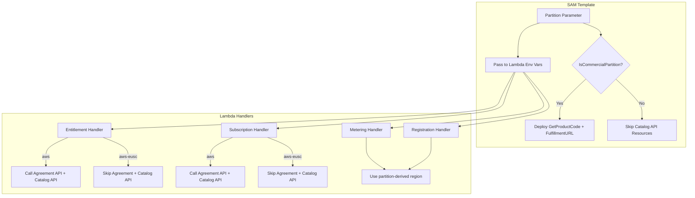
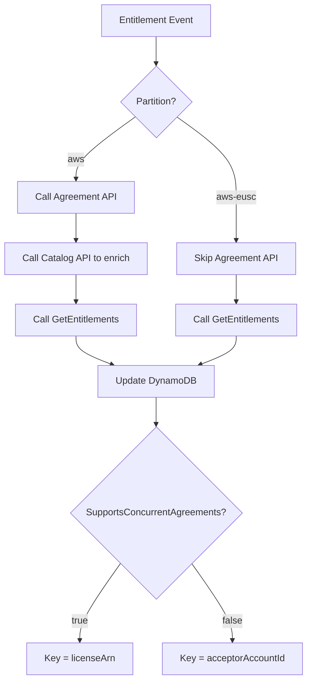

# Design Document: EUSC Support

## Overview

This design describes the changes required to make the AWS Marketplace Serverless SaaS Integration project deployable to the AWS European Sovereign Cloud (EUSC) partition (`aws-eusc`). The current implementation hardcodes references to the `aws` partition and `us-east-1` region across Lambda functions and the SAM template. EUSC lacks endpoints for the Marketplace Catalog API and Agreement API, and does not support concurrent agreements.

The changes fall into four categories:

1. **Partition parameterization** — A new `Partition` SAM parameter drives region resolution for SDK clients and controls conditional logic in Lambda handlers.
2. **Conditional resource deployment** — A `IsCommercialPartition` CloudFormation condition gates Catalog API–dependent custom resources (GetProductCode, FulfillmentURL).
3. **Lambda handler adaptation** — Each handler that calls Catalog API, Agreement API, or Metering API is updated to read the `Partition` env var and branch accordingly.
4. **ARN construction** — All hardcoded `arn:aws:` prefixes are replaced with partition-aware patterns (`${AWS::Partition}` in templates, regex in code).



## Architecture

The existing architecture is an event-driven serverless pipeline: EventBridge → SQS → Lambda → DynamoDB, with metering on an hourly schedule. The EUSC changes are purely additive — no new services or resources are introduced. Instead, the existing components gain partition awareness through configuration.

### Key Architectural Decisions

**Decision 1: Partition parameter instead of region parameter**
The `Partition` parameter (values: `aws`, `aws-eusc`) is used rather than a region parameter because:
- Multiple behaviors (API availability, ARN format, endpoint resolution) depend on the partition, not just the region.
- The AWS SDK can resolve the correct regional endpoint from the partition.
- It keeps the parameter space small and semantically clear.

**Decision 2: Environment variable–based branching in Lambda handlers**
Each Lambda reads `process.env.Partition` at runtime to decide whether to call Catalog/Agreement APIs. This is preferred over separate Lambda code paths or Lambda layers because:
- It minimizes code duplication.
- It keeps the deployment artifact identical across partitions.
- The branching logic is simple (a single `if` check).

**Decision 3: CloudFormation Condition for Catalog API resources**
The `IsCommercialPartition` condition is attached to GetProductCode, FulfillmentURL, their IAM role, and invocations. This ensures the stack deploys cleanly in EUSC without attempting to create resources that would fail.

**Decision 4: SupportsConcurrentAgreements as a separate parameter**
Rather than inferring concurrent agreement support from the partition, an explicit `SupportsConcurrentAgreements` parameter is exposed. This allows flexibility if other partitions with different capabilities are added in the future.

### Partition-to-Region Mapping

For Marketplace API calls, the SDK client region is derived from the partition:

| Partition   | Marketplace API Region |
|-------------|----------------------|
| `aws`       | `us-east-1`          |
| `aws-eusc`  | EUSC regional endpoint (SDK-resolved) |

A helper function `getMarketplaceRegion(partition)` centralizes this mapping.

## Components and Interfaces

### Modified Components

#### 1. SAM Template (`template.yaml`)

**New Parameters:**
- `Partition` — String, default `aws`. Passed as env var to all relevant Lambda functions.
- `SupportsConcurrentAgreements` — String, allowed values `true`/`false`, default `true`.

**New Condition:**
- `IsCommercialPartition` — `!Equals [!Ref Partition, "aws"]`

**Modified Parameters:**
- `MarketplaceEventSource` — AllowedValues extended to include EUSC-specific event source values.

**Conditional Resources (gated by `IsCommercialPartition`):**
- `GetProductCode` (Custom::Lambda)
- `GetProductCodeCustomResource` (AWS::Lambda::Function)
- `FulfillmentURL` (Custom::Lambda) — also gated by existing `UpdateFulfillment` condition
- `UpdateFulfillmentURLCustomResource` (AWS::Lambda::Function)
- `CAPILambdasExecutionRole` (AWS::IAM::Role)

**ARN Fixes:**
- `CrossAccountRoleForSaaSIntegration` — Replace `arn:aws:iam:` with `!Sub "arn:${AWS::Partition}:iam:"`.
- `S3BucketPolicy` — Replace hardcoded `arn:aws:s3:::` and `arn:aws:cloudfront::` with `${AWS::Partition}` equivalents.
- `CAPILambdasExecutionRole` — Already uses `${AWS::Partition}` in some places; ensure consistency.

**Environment Variable Additions:**
| Lambda Function | New Env Vars |
|----------------|-------------|
| EntitlementSQSHandler | `Partition`, `SupportsConcurrentAgreements` |
| SubscriptionSQSHandler | `Partition`, `SupportsConcurrentAgreements` |
| MeteringSQSHandler | `Partition` |
| RegisterNewMarketplaceCustomer | `Partition`, `SupportsConcurrentAgreements` |

**ProductCode Reference Fix:**
- `MeteringSQSHandler.Environment.Variables.ProductCode` currently references `!GetAtt GetProductCode.ProductCode`. In EUSC, GetProductCode doesn't exist. Use `!If [IsCommercialPartition, !GetAtt GetProductCode.ProductCode, !Ref ProductId]` or pass `ProductId` directly and resolve in code.


#### 2. Entitlement Handler (`src/entitlement-sqs.js`)

**Current behavior:** Calls `getAgreementDetails()` (Agreement API via `MarketplaceAgreementClient` hardcoded to `us-east-1`), `getMarketplaceProduct()` (Catalog API via `MarketplaceCatalogClient`), and `getEntitlements()` (Entitlement API). Uses `licenseArn` as the DynamoDB key.

**Changes:**
- Read `Partition` and `SupportsConcurrentAgreements` from `process.env`.
- `getAgreementDetails()`: Skip entirely when `Partition !== 'aws'`. Return `null` and set `isFreeTrialTermPresent = false`.
- `getMarketplaceProduct()`: Skip when `Partition !== 'aws'`. When `Partition === 'aws'`, the Catalog API MAY be used to enrich entitlement data.
- `getEntitlements()`: Always called regardless of partition. Use `getMarketplaceRegion(partition)` for the `MarketplaceEntitlementServiceClient` region.
- DynamoDB key: When `SupportsConcurrentAgreements === 'false'`, use `acceptorAccountId` instead of `licenseArn`.



#### 3. Subscription Handler (`src/subscription-sqs.js`)

**Current behavior:** Calls `getAgreementDetails()` (Agreement API hardcoded to `us-east-1`) to validate the agreement and check if the product matches. Uses commented-out Catalog API code to resolve offer/product details. Uses `acceptorAccountId` as DynamoDB key.

**Changes:**
- Read `Partition` and `SupportsConcurrentAgreements` from `process.env`.
- `getAgreementDetails()`: When `Partition !== 'aws'`, skip the Agreement API call. When `Partition === 'aws'`, use `getMarketplaceRegion(partition)` instead of hardcoded `us-east-1` for the `MarketplaceAgreementClient`.
- Catalog API: When the product code is available in the event payload (`body.detail.product.code`), use it directly and skip the Catalog API call regardless of partition. When the product code is NOT in the event payload and `Partition === 'aws'`, call the Catalog API to resolve it. When the product code is NOT in the event payload and `Partition === 'aws-eusc'`, log a warning since the Catalog API is unavailable.
- DynamoDB key: When `SupportsConcurrentAgreements === 'false'`, use `acceptorAccountId` (already the current behavior). When `true`, use `licenseArn` from the event if available.

#### 4. Metering Handler (`src/metering-sqs.js`)

**Current behavior:** Initializes `MarketplaceMeteringClient` with hardcoded `region: 'us-east-1'`. Checks `body.customerIdentifier.startsWith('arn:aws:license-manager:')` for license ARN detection.

**Changes:**
- Read `Partition` from `process.env`.
- Initialize `MarketplaceMeteringClient` with `region: getMarketplaceRegion(partition)` instead of `'us-east-1'`.
- Replace the hardcoded ARN prefix check `'arn:aws:license-manager:'` with a partition-aware regex pattern: `/^arn:[a-z\-]+:license-manager:/` to match both `arn:aws:` and `arn:aws-eusc:` prefixes.

#### 5. Registration Handler (`src/register-new-subscriber.js`)

**Current behavior:** Initializes `MarketplaceMeteringClient` with `region: aws_region` (from `AWS_REGION` env var) for `ResolveCustomer`. Uses `LicenseArn` as the DynamoDB key.

**Changes:**
- Read `Partition` and `SupportsConcurrentAgreements` from `process.env`.
- Initialize `MarketplaceMeteringClient` with `region: getMarketplaceRegion(partition)` for `ResolveCustomer` calls.
- DynamoDB key: When `SupportsConcurrentAgreements === 'false'`, use `CustomerAWSAccountId` instead of `LicenseArn`.

#### 6. Shared Utility: `getMarketplaceRegion(partition)`

A new helper function (can be defined inline in each handler or extracted to a shared module) that maps partition to the correct Marketplace API region:

```javascript
function getMarketplaceRegion(partition) {
  const regionMap = {
    'aws': 'us-east-1',
    // Add EUSC region mapping when endpoint is known.
    // For now, the SDK resolves the region from the partition.
  };
  return regionMap[partition] || undefined; // undefined lets SDK use default resolution
}
```

If the partition is not in the map, returning `undefined` allows the AWS SDK to resolve the endpoint using its built-in partition metadata.

### Unchanged Components

- **Metering Hourly Job** (`metering-hourly-job.js`) — Only queries DynamoDB and sends to SQS. No Marketplace API calls. No changes needed.
- **Grant/Revoke Access** (`grant-revoke-access-to-product.js`) — Processes DynamoDB streams and publishes to SNS. No Marketplace API calls. No changes needed.
- **Redirect Handler** (`redirect.js`) — Simple HTTP redirect. No changes needed.

## Data Models

### DynamoDB: AWSMarketplaceSubscribers Table

The table schema remains unchanged. The key behavioral difference is in what value is used for the `customerIdentifier` hash key:

| Scenario | `customerIdentifier` Value |
|----------|---------------------------|
| Commercial (`SupportsConcurrentAgreements=true`) | `licenseArn` (e.g., `arn:aws:license-manager:us-east-1:123456789012:license/lic-xxx`) |
| EUSC (`SupportsConcurrentAgreements=false`) | `acceptorAccountId` (e.g., `123456789012`) |

This means EUSC deployments have one record per buyer account per product, while commercial deployments can have multiple records (one per license/agreement).

### DynamoDB: AWSMarketplaceMeteringRecords Table

No schema changes. The `customerIdentifier` field will contain either a license ARN or an account ID depending on the partition, which is already handled by the existing metering logic.

### Environment Variables (New/Modified)

| Variable | Source | Used By | Values |
|----------|--------|---------|--------|
| `Partition` | SAM Parameter | Entitlement, Subscription, Metering, Registration handlers | `aws`, `aws-eusc` |
| `SupportsConcurrentAgreements` | SAM Parameter | Entitlement, Subscription, Registration handlers | `true`, `false` |

### SAM Template Parameters (New)

```yaml
Partition:
  Type: String
  Default: "aws"
  AllowedValues:
    - "aws"
    - "aws-eusc"
  Description: "AWS partition for Marketplace API endpoint resolution"

SupportsConcurrentAgreements:
  Type: String
  Default: "true"
  AllowedValues:
    - "true"
    - "false"
  Description: "Whether the partition supports concurrent agreements. Set to false for EUSC."
```


## Correctness Properties

*A property is a characteristic or behavior that should hold true across all valid executions of a system — essentially, a formal statement about what the system should do. Properties serve as the bridge between human-readable specifications and machine-verifiable correctness guarantees.*

### Property 1: Marketplace API region is derived from partition

*For any* valid partition value (`aws`, `aws-eusc`), the `getMarketplaceRegion` function should return the correct Marketplace API region for that partition — `us-east-1` for `aws`, and the appropriate EUSC region for `aws-eusc`. No handler should ever use a hardcoded `us-east-1` when the partition is not `aws`.

**Validates: Requirements 1.7**

### Property 2: Template ARN construction uses parameterized partition

*For any* ARN string constructed in IAM policies or resource references within the SAM template, the partition segment should use `${AWS::Partition}` rather than a hardcoded `aws` literal. Specifically, no ARN in the template (outside of comments) should contain the pattern `arn:aws:` as a literal string.

**Validates: Requirements 2.1**

### Property 3: License ARN detection is partition-aware

*For any* string that is a valid license ARN in any AWS partition (matching the pattern `arn:<partition>:license-manager:<region>:<account>:license/<id>`), the metering handler's license ARN detection logic should correctly identify it as a license ARN, regardless of the partition segment.

**Validates: Requirements 2.2**

### Property 4: DynamoDB key selection is determined by SupportsConcurrentAgreements

*For any* event processed by the entitlement handler, subscription handler, or registration handler, when `SupportsConcurrentAgreements` is `false`, the DynamoDB key used for the subscriber record should be the acceptor account ID (or customer AWS account ID). When `SupportsConcurrentAgreements` is `true`, the DynamoDB key should be the license ARN.

**Validates: Requirements 4.3, 4.4, 4.5, 6.3**

## Error Handling

### Partition-Related Error Scenarios

| Scenario | Handler | Behavior |
|----------|---------|----------|
| Unknown partition value | All handlers | `getMarketplaceRegion` returns `undefined`, allowing SDK default resolution. If SDK cannot resolve, the API call fails and is logged. |
| Agreement API call fails in commercial | Entitlement, Subscription | Existing error handling applies — error is logged, `agreementDetails` returns `null`, processing continues with degraded data. |
| Catalog API call fails in commercial | Entitlement | Existing fallback logic applies — `resultProduct.failure = true`, falls back to `pricingModel` check. |
| Missing `Partition` env var | All handlers | Defaults to `undefined`. `getMarketplaceRegion(undefined)` returns `undefined`, SDK uses default resolution. Handlers should treat missing partition as commercial (`aws`) for backward compatibility. |
| Missing `SupportsConcurrentAgreements` env var | Entitlement, Subscription, Registration | Defaults to `undefined`. Handlers should treat missing value as `true` (current behavior) for backward compatibility. |

### Backward Compatibility

All changes are backward compatible:
- If `Partition` is not set, handlers default to commercial behavior (Agreement API + Catalog API calls enabled).
- If `SupportsConcurrentAgreements` is not set, handlers default to `true` (license ARN as DynamoDB key).
- The SAM template defaults `Partition` to `aws` and `SupportsConcurrentAgreements` to `true`, so existing deployments are unaffected.

## Testing Strategy

### Unit Tests

Unit tests verify specific scenarios using mocked AWS SDK clients:

1. **Entitlement handler — commercial partition**: Verify Agreement API and Catalog API are called when `Partition=aws`.
2. **Entitlement handler — EUSC partition**: Verify Agreement API and Catalog API are NOT called when `Partition=aws-eusc`, and fallback logic is used.
3. **Subscription handler — commercial partition**: Verify Agreement API is called when `Partition=aws`.
4. **Subscription handler — EUSC partition**: Verify Agreement API is NOT called when `Partition=aws-eusc`, and product code is taken from event payload.
5. **Metering handler — region initialization**: Verify `MarketplaceMeteringClient` is initialized with partition-derived region, not hardcoded `us-east-1`.
6. **Registration handler — EUSC partition**: Verify `MarketplaceMeteringClient` uses partition-derived region for `ResolveCustomer`.
7. **DynamoDB key — concurrent agreements disabled**: Verify `acceptorAccountId` is used as key when `SupportsConcurrentAgreements=false`.
8. **DynamoDB key — concurrent agreements enabled**: Verify `licenseArn` is used as key when `SupportsConcurrentAgreements=true`.
9. **License ARN detection**: Verify `arn:aws-eusc:license-manager:...` is correctly identified as a license ARN.
10. **SAM template validation**: Verify template parses correctly with EUSC parameter values.

### Property-Based Tests

Property-based tests use a PBT library (e.g., `fast-check` for Node.js) to verify universal properties across generated inputs. Each test runs a minimum of 100 iterations.

1. **Property 1 test**: Generate random valid partition strings from the allowed set. For each, verify `getMarketplaceRegion` returns the expected region and never returns `us-east-1` for non-`aws` partitions.
   - Tag: `Feature: eusc-support, Property 1: Marketplace API region is derived from partition`

2. **Property 2 test**: Parse the SAM template YAML and extract all ARN strings from IAM policies and resource references. For each ARN, verify it does not contain a hardcoded `arn:aws:` literal (should use `${AWS::Partition}` or `!Sub` with partition reference).
   - Tag: `Feature: eusc-support, Property 2: Template ARN construction uses parameterized partition`

3. **Property 3 test**: Generate random license ARN strings with varying partition segments (e.g., `aws`, `aws-eusc`, `aws-cn`, arbitrary strings). For each valid license ARN, verify the detection regex returns `true`. For non-ARN strings, verify it returns `false`.
   - Tag: `Feature: eusc-support, Property 3: License ARN detection is partition-aware`

4. **Property 4 test**: Generate random event payloads containing both `licenseArn` and `acceptorAccountId` fields. For each combination of `SupportsConcurrentAgreements` (`true`/`false`), verify the DynamoDB key selection function returns the correct field value.
   - Tag: `Feature: eusc-support, Property 4: DynamoDB key selection is determined by SupportsConcurrentAgreements`

### Test Framework

- **Unit test framework**: Jest (already standard for Node.js Lambda projects)
- **Property-based testing library**: `fast-check` — the most mature PBT library for JavaScript/Node.js
- **Mocking**: `aws-sdk-client-mock` for AWS SDK v3 client mocking
- Each property-based test must run a minimum of 100 iterations
- Each property test must include a comment referencing the design property it validates
