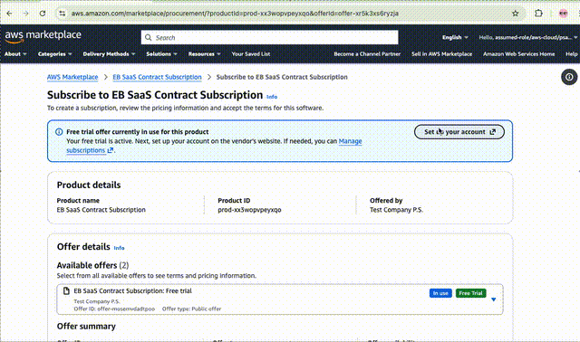
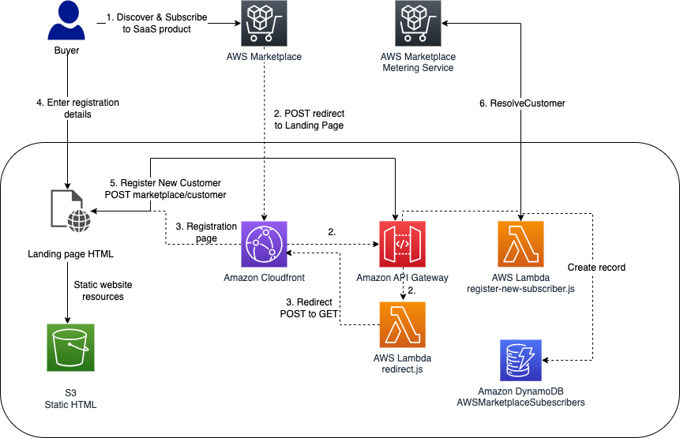
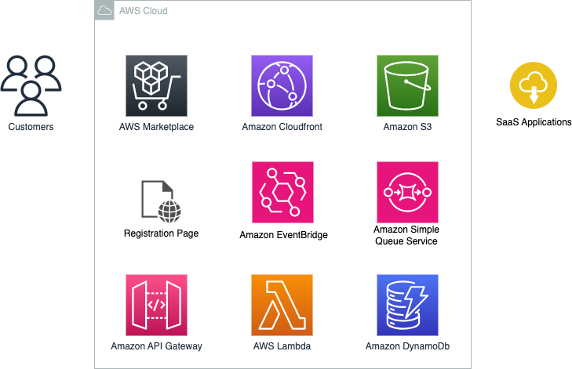
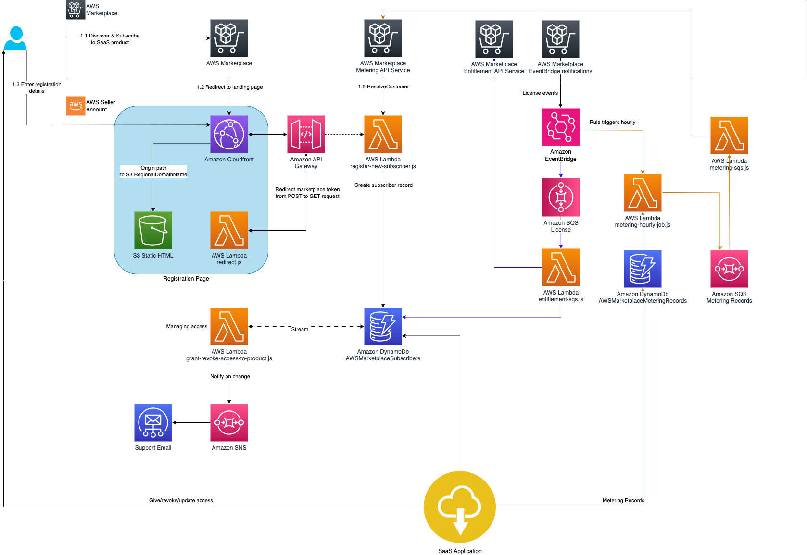

# AWS Marketplace - Serverless integration for SaaS products (Example)


> [**UPDATE April 2026 EventBridge notifications**]
> The serverless integration for SaaS products has been updated to use [Amazon EventBridge notifications](https://docs.aws.amazon.com/marketplace/latest/userguide/saas-eventbridge-integration.html). License events are processed via EventBridge rules and SQS queues. The solution no longer uses Amazon SNS topics from AWS Marketplace for notifications. All lifecycle events are handled by [EventBridge license events](https://docs.aws.amazon.com/marketplace/latest/userguide/notifications-eventbridge.html#events-for-licenses).

> [**UPDATE April 2026 CustomerIdentifier**]
> The `CustomerIdentifier` parameter for AWS Marketplace API is scheduled for deprecation. The current implementation uses the **License ARN** (`LicenseArn`) as the primary customer identifier in the NewSubscribersTable and as filter for the [GetEntitlements API](https://docs.aws.amazon.com/marketplace/latest/APIReference/API_marketplace-entitlements_GetEntitlements.html). There are still key names in the DynamoDB tables that use the **name** `customerIdentifier`, but the **value** stored is the License ARN from the EventBridge event. This provides a stable, unique identifier for each customer's entitlement across the lifecycle of a subscription. By using the **License ARN** as `customerIdentifier` and for getting entitlements the solution supports [Concurrent Agreements](https://aws.amazon.com/about-aws/whats-new/2026/02/concurrent-agreements-february/) on AWS Marketplace.


This project demonstrates a serverless integration example to [onboard customers](https://docs.aws.amazon.com/marketplace/latest/userguide/saas-product-customer-setup.html) for SaaS products in AWS Marketplace using AWS SAM (Serverless Application Model) for configuration, building, and deployment. It is primarily designed for users who are familiar with deploying AWS resources via CLI, need full configuration options, and want to customize the sample. For users seeking a simpler approach with less configuration, limited customization needs, or demo purposes, an alternative lab called "[Integrate your SaaS with the Serverless SaaS Integration reference](https://catalog.workshops.aws/mpseller/en-US/saas/integration-with-quickstart#background)" is available.

> [**!IMPORTANT**]
> **For reference purposes only**: The solution created in this repo serves as a reference demonstrating the core components needed for integrating and operating a SaaS listing in AWS Marketplace. While we periodically update the solution to reflect current integration standards, it does not adhere to any service level agreement. Proceed with caution if you intend to use this solution in your production accounts, or on production or other critical data. You are responsible for testing, securing, and optimizing AWS Content, such as sample code, as appropriate for production grade use based on your specific quality control practices and standards.

If you are a new seller on AWS Marketplace, we strongly recommend to check the following resources: 

* [SaaS Product Requirements & Recommendations](https://docs.aws.amazon.com/marketplace/latest/userguide/saas-guidelines.html) : This document outlines the requirements that must be met before gaining approval to publish a SaaS product to the catalog.
* [SaaS Listing Process & Integration Guide](https://awsmp-loadforms.s3.amazonaws.com/AWS+Marketplace+-+SaaS+Integration+Guide.pdf) : This document outlines what is required to integrate with Marketplace for each SaaS pricing model. You will find integration diagrams, codes examples, FAQs, and additional resources.
* [Managing SaaS subscription events with Amazon EventBridge](https://docs.aws.amazon.com/marketplace/latest/userguide/saas-eventbridge-integration.html) : The documentation explains how to use Amazon EventBridge to integrate and manage SaaS products with AWS Marketplace.
* [SaaS Integration Video](https://www.youtube.com/watch?v=glG44f-L8us) : This video guides you through the requirements and steps needed to integrate. 
* [SaaS Pricing Video](https://www.youtube.com/watch?v=E0uWp8nhzAk) : This video guides you through the pricing options available when choosing to list a SaaS product.
* [AWS Marketplace - Seller Guide](https://docs.aws.amazon.com/marketplace/latest/userguide/what-is-marketplace.html) : This document covers more information about creating a SaaS product, pricing, and setting up your integration.


# Project Structure

The sample in this repository demonstrates how to use AWS SAM (Serverless application model) to integrate your SaaS product with AWS Marketplace and how to perform:

- [Register new customers](#register-new-customers)
- [Grant and revoke access to your product](#grant-and-revoke-access-to-your-product)
- [Metering for usage](#metering-for-usage)
- [Deploying the sample application using Serverless Application Model Command Line Interface (SAM CLI)](#)


## Register new customers

With SaaS subscriptions and SaaS contracts, your customers subscribe to your products through AWS Marketplace, but access the product on environment you manage in your AWS account. After subscribing to the product, your customer is directed to a website you create and manage as a part of your SaaS product to register their account and configure the product.

When creating your product, you provide a URL to your registration landing page. AWS Marketplace uses that URL to redirect customers to your registration landing page after they subscribe. On your software's registration URL, you collect whatever information is required to create an account for the customer. AWS Marketplace recommends collecting your customer’s email addresses if you plan to contact them through email for usage notifications.

The registration landing page needs to be able to identify and accept the `x-amzn-marketplace-token` token in the form data from AWS Marketplace. Your landing page calls the [ResolveCustomer API](https://docs.aws.amazon.com/marketplace/latest/APIReference/API_marketplace-metering_ResolveCustomer.html) to get and persist **LicenseArn**, **CustomerAWSAccountId** and **ProductCode**. You use the **LicenseArn** and **CustomerAWSAccountId** for usage based billing. By using the **LicenseArn** you can meter product usage that have a **Concurrent Agreement**.




> NOTE: Deploying the static landing page is optional.
You can choose to use your existing SaaS registration page, after collecting the data you should call the register new subscriber endpoint. Please see the deployment section.

### Implementation

This sample deploys an **Amazon CloudFront** Distribution, which can be configured to use domain/CNAME by your choice. The POST request coming from AWS Marketplace is send to the CloudFront Distribution. From there it send to an **Amazon API Gateway**. The API Gateway invokes an **AWS Lambda** function - `src/redirect.js` - which transforms the POST request to a GET request, and passes the `x-amzn-marketplace-token` in the query string. 
A static landing page hosted on S3 behind CloudFront takes the users inputs defined in the html form and submits them to the /subscriber API Gateway endpoint.

The handler for the /subscriber endpoint is defined in the `src/register-new-subscriber.js` file. This lambda function calls the [ResolveCustomer API](https://docs.aws.amazon.com/marketplace/latest/APIReference/API_marketplace-metering_ResolveCustomer.html) and validates the token. If the token is valid, a customer record is created in the `AWSMarketplaceSubscribers` DynamoDB table and the data the customer submitted in the html form is stored.



## Grant and revoke access to your product

### Grant access to new subscribers

Once the **ResolveCustomer API** returns a successful response, the SaaS vendors must to provide access to the solution to the new subscriber. 
Based on the type of listing, contract or subscription, we have defined different conditions in the `grant-revoke-access-to-product.js` stream handler that is executed on adding new or updating existing rows.

In our implementation the Marketplace Tech Admin (The email address you have entered when deploying), will receive an email when new environment needs to be provisioned or existing environment needs to be updated. AWS Marketplace strongly recommends automating the access and environment management which can be achieved by modifying the `grant-revoke-access-to-product.js` function.

The property successfully subscribed is set when successful response is returned from the SQS entitlement handler for SaaS Contract based listings after receiving a **License Updated** event via Amazon EventBridge.


### Update entitlement levels to new subscribers (SaaS Contracts only)

Each time the entitlement is updated AWS Marketplace publishes a **License Updated** event to Amazon EventBride in the sellers account. An EventBridge rule sends the message to the Entitlement SQS queue. The lambda function `entitlement-sqs.js` is triggered by SQS on each message is calling the marketplaceEntitlementService when the product ist contract based. `entitlement-sqs.js` has a built-in logic to determine if your product has entitlement definitions. After gathering all data it is stored in the DynamoDB `AWSMarketplaceSubscribers` table.

We are using the same DynamoDB stream to detect changes in the DynamoDB table. When an item is updated, a notification is sent to the `MarketplaceTechAdmin`.


### Revoke access to customers with expired contracts and cancelled subscriptions 

The revoke access logic is implemented in a similar manner as the grant access logic but uses the **License Deprovisioned** event.

In our implementation the `MarketplaceTechAdmin` receives email when the contract expires or the subscription is cancelled. 
AWS Marketplace strongly recommends automating the access and environment management which can be achieved by modifying the `grant-revoke-access-to-product.js` function.

## Metering for usage

For SaaS subscriptions, the SaaS provider must meter for all usage, and then customers are billed by AWS based on the metering records provided. For SaaS contracts, you only meter for usage beyond a customer’s contract entitlements. When your application meters usage for a customer, your application is providing AWS with a quantity of usage accrued. Your application meters for the pricing dimensions that you defined when you created your product, such as gigabytes transferred or hosts scanned in a given hour.

This solution includes a [Jupyter notebook](./test/test-metering.ipynb) to test metering for SaaS products with externally metered dimensions.

### Implementation

The solutions creates a MeteringSchedule rule in Amazon EventBridge that triggers the `metering-hourly-job.js` Lambda function **hourly**. It's querying all of the pending/unreported metering records from the `AWSMarketplaceMeteringRecords` table using the PendingMeteringRecordsIndex.
All of the pending records are aggregated based on the customerIdentifier and dimension name, and sent to the SQSMetering queue.
The records in the `AWSMarketplaceMeteringRecords` table are expected to be inserted programmatically by your SaaS application. In this case you will have to give permissions to the service in charge of collecting usage data in your existing SaaS product to be able to write to `AWSMarketplaceMeteringRecords` table. 

The lambda function `metering-sqs.js` is sending all of the queued metering records to the AWS Marketplace Metering service.
After every call to the `batchMeterUsage` endpoint the rows are updated in the AWSMarketplaceMeteringRecords table, with the response returned from the Metering Service, which can be found in the `metering_response` field. If the request was unsuccessful the metering_failed value with be set to true and you will have to investigate the issue the error will be also stored in the `metering_response` field.

Logs from `metering-hourly-job.js` and `metering-sqs.js` are stored in CloudWatch logs where you can find detailed information about the metering process.

The new records in the AWSMarketplaceMeteringRecords table must be stored in the following format:


```javascript
{
  "create_timestamp": {
    "N": "1763634471636562122"
  },
  "customerIdentifier": {
    "S": "arn:aws:license-manager::123456789012:license/lic-EXAMPLE12345"
  },
  "dimension_usage": {
    "L": [
      {
        "M": {
          "dimension": {
            "S": "users"
          },
          "value": {
            "N": "3"
          }
        }
      },
      {
        "M": {
          "dimension": {
            "S": "admin_users"
          },
          "value": {
            "N": "1"
          }
        }
      }
    ]
  },
  "metering_pending": {
    "S": "true"
  }
}
```

Where the `create_timestamp` is the sort key and `customerIdentifier` is the partition key, and they are both forming the Primary key.

**Note**: You are responsible to choose a timestamp precision for your setup. For example when you use seconds precision for the `create_timestamp` and try to put more than one within one second in the table with the same `create_timestamp` and `customerIdentifier`, only one record will be stored. You can use for example nano seconds precision for `create_timestamp` which is virtually unique.

**Note**: The new records format is in **DynamoDB JSON** format. It is different than JSON. The accepted time stamp is UNIX timestamp in UTC time. 

After the record is submitted to AWS Marketplace BatchMeterUsage API, it will be updated and it will look like this:

```javascript
{
  "create_timestamp": 1763634471636562122,
  "customerIdentifier": "arn:aws:license-manager::123456789012:license/lic-EXAMPLE12345",
  "dimension_usage": [
    {
      "dimension": "admin_users",
      "value": 3
    }
  ],
  "metering_failed": false,
  "metering_response": "{\"Results\":[{\"UsageRecord\":{\"Timestamp\":\"2020-06-24T04:04:53.776Z\",\"CustomerIdentifier\":\"ifAPi5AcF3\",\"Dimension\":\"admin_users\",\"Quantity\":3},\"MeteringRecordId\":\"35155d37-56cb-423f-8554-5c4f3e3ff56d\",\"Status\":\"Success\"}],\"UnprocessedRecords\":[]}"
}
```

## Deploying the sample application using the SAM CLI

The Serverless Application Model Command Line Interface (SAM CLI) is an extension of the AWS CLI that adds functionality for building and testing Lambda applications. To learn more about SAM, visit the [AWS SAM developer guide](https://docs.aws.amazon.com/serverless-application-model/latest/developerguide/serverless-sam-cli-install.html).

To build and deploy your application, you must sign in to the AWS Management Console with IAM permissions for the resources that the templates deploy. For more information, see [AWS managed policies for job functions](https://docs.aws.amazon.com/IAM/latest/UserGuide/access_policies_job-functions.html). Your organization may choose to use a custom policy with more restrictions. These are the AWS services that you need permissions to create as part of the deployment:

* AWS IAM role
* Amazon CloudWatch Logs
* Amazon CloudFront
* Amazon S3 bucket
* AWS CloudFormation stack
* AWS Lambda function
* Amazon API Gateway
* Amazon DynamoDB database
* Amazon SQS queue
* Amazon SNS topic
* Amazon EventBridge rule


> [!NOTE]  
For simplicity, we use [AWS CloudShell](https://docs.aws.amazon.com/cloudshell/latest/userguide/welcome.html) to deploy the application since it has the required tools pre-installed. If you wish to run the deployment in an alternate shell, you'll need to install [Docker community edition](https://hub.docker.com/search/?type=edition&offering=community), [Node.js](https://nodejs.org/en/) (including NPM), [AWS CLI](https://docs.aws.amazon.com/cli/latest/userguide/getting-started-install.html), and [SAM CLI](https://docs.aws.amazon.com/serverless-application-model/latest/developerguide/serverless-sam-cli-install.html).


To build and deploy your application for the first time, complete the following steps.

1. Using the AWS account registered as your [AWS Marketplace Seller account](https://docs.aws.amazon.com/marketplace/latest/userguide/seller-registration-process.html), open [AWS CloudShell](https://us-east-1.console.aws.amazon.com/cloudshell). 

2. Clone the **aws-marketplace-serverless-saas-integration repository** and change to the root of the repository.

  ```bash
  git clone https://github.com/aws-samples/aws-marketplace-serverless-saas-integration.git
  ```

3. Change to the root directory of the repository

  ```bash
  cd aws-marketplace-serverless-saas-integration
  ```

4. Build the application using SAM. 

  ```bash
  sam build
  ```

5. Deploy the application using the SAM guided experience.

  ```bash
  sam deploy --guided --capabilities CAPABILITY_NAMED_IAM
  ```

6. Follow the SAM guided experience to configure the deployment. Reference the following table for solution parameters.
 
    Parameter name | Description
    ------------ | -------------
    Stack Name | Name of the resulting CloudFormation stack.
    AWS Region | Name of the region that the solution is being deployed in. Default value: us-east-1
    WebsiteS3BucketName | S3 bucket to store the HTML files; Mandatory if CreateRegistrationWebPage is set to true; will be created
    NewSubscribersTableName | Name for the New Subscribers Table; Default value: AWSMarketplaceSubscribers
    AWSMarketplaceMeteringRecordsTableName | Name for the Metering Records Table; Default value: AWSMarketplaceMeteringRecords
    TypeOfSaaSListing | allowed values: contracts_with_subscription, contracts, subscriptions; Default value: contracts_with_subscription
    ProductId | Product id provided from AWS Marketplace
    MarketplaceTechAdminEmail | Email to be notified on changes requiring action
    MarketplaceSellerEmail | (Optional) Seller email address, verified in SES and in 'Production' mode. See [Verify an email address](https://docs.aws.amazon.com/ses/latest/DeveloperGuide/verify-email-addresses-procedure.html) for instruction to verify email addresses.
    CreateCrossAccountRole | Creates a cross-account role granting access to the NewSubscribersTableName and AWSMarketplaceMeteringRecordsTableName tables. Default value: false.
    CrossAccountId | (Optional) AWS account ID for the cross-account role.
    CrossAccountRoleName |  (Optional) Role name for the cross-account role.
    CreateRegistrationWebPage | Creates a registration page. Default value: true
    UpdateFulfillmentURL  | (Optional) Update the MarketplaceFulfillmentUrl in your AWS Marketplace Management Portal with the value from the output key 'MarketplaceFulfillmentUrl'. The value would be in a the form of a AWS cloudfront based url. Default value: false

7. Wait for the stack to complete successfully.

8. Check the email account for **MarketplaceTechAdminEmail** and approve the subscription to the Support SNS topic to receive notifications about new subscribers and subscription changes.


### Diagram of created resources

Based on the value of the **TypeOfSaaSListing** parameter different set of resources will be deployed: 

* In the case of ***contracts_with_subscription*** or ***subscriptions*** **all** of the **resources** depicted on the diagram below will be **deployed**.

* In the case of a ***contracts***, the resources market with **orange** circles will **not be deployed**.

The landing page is optional. Use the ***CreateRegistrationWebPage*** parameter to control if the registration page will be deployed.




### Event Flow

The following diagram shows the detailed workflow of how events flow through the system when a customer subscribes, updates their entitlement, or cancels their subscription:



## Testing

The directory [test](test) includes some resources that you can use to test your deployment. You can create metering records, compare if your product uses the fulfillment URL from your stack or query CloudWatch logs. For more details,
see the [README](test/README.md) in the directory **test**.


## Helper Scripts

The `helper/` directory contains utility scripts for post-deployment operations.

### Set log retention

Log groups are created without a retention policy by default. Use this script to set retention on all log groups in the stack (Lambda functions, EventBridge rules, and custom resources, including nested stacks):

```bash
# Dry run to preview changes
python3 helper/set-log-retention.py --stack-name <stack-name> --retention-days 7 --dry-run

# Apply retention
python3 helper/set-log-retention.py --stack-name <stack-name> --retention-days 7
```

Options:
- `--stack-name` (required): CloudFormation stack name
- `--retention-days`: Retention period in days (default: 7). Allowed values: 1, 3, 5, 7, 14, 30, 60, 90, 120, 150, 180, 365, 400, 545, 731, 1096, 1827, 2192, 2557, 2922, 3288, 3653
- `--region`: AWS region
- `--dry-run`: Show what would be changed without applying

### Empty the CloudFront log bucket

Before deleting the stack, the CloudFront log bucket must be emptied. This script finds the log bucket from the stack and removes all objects:

```bash
helper/empty-log-bucket.sh <stack-name>
```

## Cleanup

To delete the sample application that you created, first empty the log bucket, then delete the stack:

```bash
helper/empty-log-bucket.sh <stack-name>
aws cloudformation delete-stack --stack-name <stack-name>
```


## Security

See [CONTRIBUTING](CONTRIBUTING.md#security-issue-notifications) for more information.

## License

This library is licensed under the MIT-0 License. See the LICENSE file.


## Post deployment steps

1. Update the **MarketplaceFulfillmentUrl** (if you did not choose to update the fulfillment URL with the deployment) in your AWS Marketplace Management Portal with the value from the output key 'MarketplaceFulfillmentUrl'. The value would be in a the form of a AWS cloudfront based url.
2. Ensure the email address used is a verified identity/domain in Amazon Simple Email Service.
3. Ensure your Amazon Simple Email Service account is a production account. 

## Legacy version (SNS notifications)
The previous version of this integration used Amazon SNS topics for marketplace notifications. If you need to use that version, check out the last commit before the EventBridge migration:

```bash
git checkout beeb9bb15293eb8ea433245c182e8d23e7d47be7
```